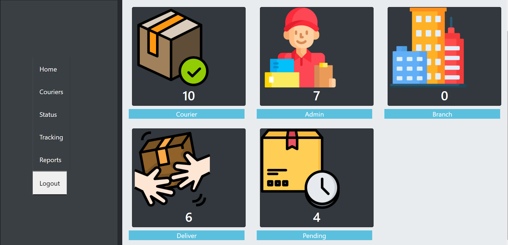

<p align="center"></a></p>


<p align="center"><a href="https://laravel.com" target="_blank"></a></p>

<p align="center">
<a href="https://travis-ci.org/laravel/framework"></a>
<a href="https://packagist.org/packages/laravel/framework"></a>
<a href="https://packagist.org/packages/laravel/framework"></a>
<a href="https://packagist.org/packages/laravel/framework"></a>
</p>


<h2 align="center">Laravel + React </h2>
<h3 align="center">Courier Management System</h3>

<h2>Create Laravel Project</h2>

```
1. composer create-project Laravel/Laravel="7.x" react-Laravel-application                                                                   
2. cd react-Laravel-application                                                        
3. code . 

```


<h2>Required Pakages</h2>

<ul>
    <li><h3>axios (npm install axios)(https://www.npmjs.com/package/axios)</h3></li>
    <li><h3> Bootswatch (npm install bootswatch)(https://bootswatch.com/)</h3> </li>
</ul>

> Needs to import this in app.scss file for bootswatch theme

```
    @import "~bootswatch/dist/[theme]/variables"; 
    @import "~bootstrap/scss/bootstrap";  
    @import "~bootswatch/dist/[theme]/bootswatch";
    
```

<ul>
    <li><h3>React Connection(https://laravel.com/docs/7.x/frontend)</h3></li>
</ul>


> React Connection with Laravel . I'm using Laravel mix for working with React.

```
composer require laravel/ui:^2.5
php artisan ui react.
php artisan ui react --auth.
npm install.
npm run dev.

```

<ul>
    <li><h3>React Router(https://www.npmjs.com/package/react-router-dom)</h3></li>
</ul>

<ul>
    <li><h3>FontAwesome(https://fontawesome.com/)</h3></li>
</ul>

<ul>
    <li><h3>SweetAlert(https://sweetalert.js.org/guides/)</h3></li>
</ul>

### After clone this repository install npm, as gitignore file ignores some files.. 


## Actors 
<ul>
    <li> Admin</li>
    <li> Customer</li>
  </ul>
  
  ## Some Clear Portion
  >Delete data using sweetAlert.<p>Always use button onClick it'll help to re-render the component instance of using NavLink</p>
  ```
      const deleteCourierData = id => {
        swal({
            title: "Are you sure?",
            text: "Once deleted, you will not be able to recover this data!",
            icon: "warning",
            buttons: true,
            dangerMode: true
        }).then(willDelete => {
            if (willDelete) {
                axios
                    .get(`/courier/delete/${id}`)
                    .then(function(response) {
                        if (response.data.status === 200) {
                            swal(response.data.message, {
                                icon: "success"
                            });
                            setMessage(true);
                        }
                    })
                    .catch(function(error) {
                        swal("Data no deleted!");
                        console.log(error);
                    });
            }
        });

        
    };
  
  ```
  >[Check the documentation of SweetAlert](https://sweetalert.js.org/guides/#getting-started)
  
 


## Project Overview





- [Simple, fast routing engine](https://laravel.com/docs/routing).
- [Powerful dependency injection container](https://laravel.com/docs/container).
- Multiple back-ends for [session](https://laravel.com/docs/session) and [cache](https://laravel.com/docs/cache) storage.
- Expressive, intuitive [database ORM](https://laravel.com/docs/eloquent).
- Database agnostic [schema migrations](https://laravel.com/docs/migrations).
- [Robust background job processing](https://laravel.com/docs/queues).
- [Real-time event broadcasting](https://laravel.com/docs/broadcasting).


